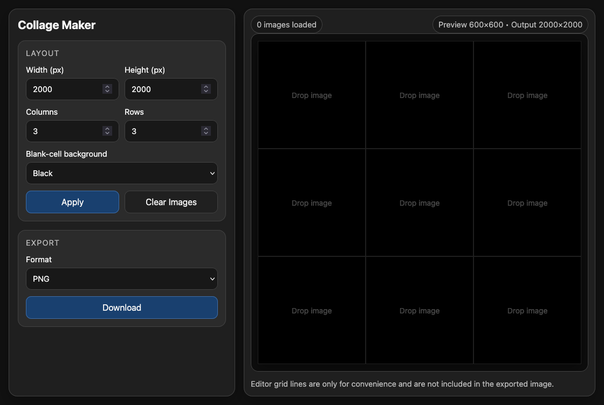

# Collage Maker

Collage Maker is a lightweight browser-based tool for arranging images into a configurable grid and exporting the result as a single collage image.

## Screenshot

## Features

* All processing is entirely local i.e. your images aren't uploaded to a server.
* Drag and drop images from Finder or Explorer into grid cells.
* Configure output width, height, rows, columns, and blank-cell background color.
* Pan and zoom each image within its cell to control cropping and composition.
* Drag images between cells to rearrange them.
* Export the finished collage as PNG or JPG.

## How It's Made

100% vibe coded. A combination of careful prompting and several hours of iterating to fix numerous bugs and usability issues.
